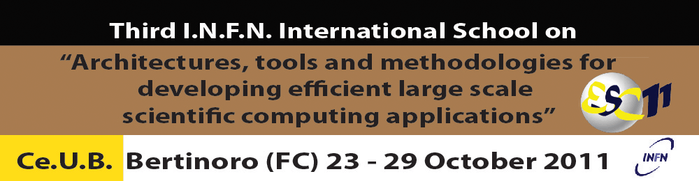

.. http://web.infn.it/esc11/images/template/header2011_1000x260v6.jpg

         methodologies for developing efficient large scale scientific
         computing applications
   :align: center
   :width: 1000
   :height: 260
   :scale: 66

ESC11 Exercises
===============

Browse `exercise material <exercises/>`_.

.. toctree::
   :numbered:
   :maxdepth: 2

   basic/index
   math/index
   c++/index
   memory/index
   openmp/index
   io/index
