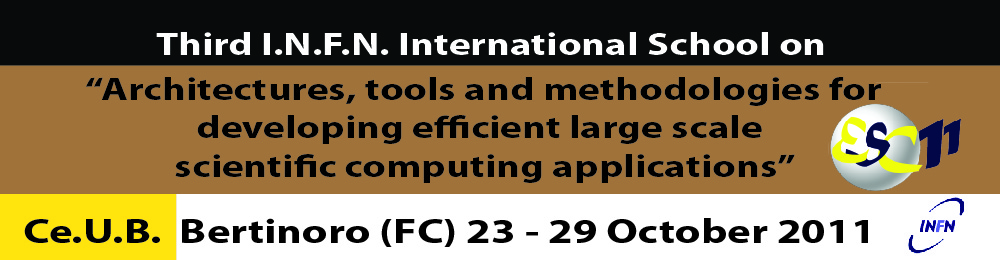

.. http://web.infn.it/esc11/images/template/header2011_1000x260v6.jpg

         methodologies for developing efficient large scale scientific
         computing applications
   :align: center
   :width: 1000
   :height: 260
   :scale: 66

ESC11 Exercises
===============

Performance tuning
------------------

Browse `exercise material <exercises/perftune/>`_.

.. toctree::
   :numbered:
   :maxdepth: 1

   tuning/intro
   tuning/basic
   tuning/sse
   tuning/matrix
   tuning/false-sharing
   tuning/cache-misses

Getting started
---------------

.. toctree::
   :numbered:
   :maxdepth: 1

   igprof-env

Basic C++ optimizations
-----------------------

Browse `exercise material <exercises/c++/>`_.

.. toctree::
   :numbered:
   :maxdepth: 1

   c++/simple-oop
   c++/template-bloat
   c++/exceptions
   c++/iostreams
   c++/inlining
   c++/constructors
   c++/metaprogram

Memory use
----------

Browse `exercise material <exercises/memory/>`_.

.. toctree::
   :numbered:
   :maxdepth: 1
   
   memory/datasize
   memory/shlib
   memory/basic
   memory/containers

Memory allocation, monitoring and debugging
-------------------------------------------

Browse `exercise material <exercises/memory/>`_.

.. toctree::
   :numbered:
   :maxdepth: 1

   memory/valgrind
   memory/word-list
   memory/large-app

Compilers, SIMD and floating point
----------------------------------

Browse `exercise material <exercises/math/>`_.

.. toctree::
   :numbered:
   :maxdepth: 1

   math/startup
   math/fpopt
   math/approx
   math/float
   math/simd
   math/algebra

I/O efficiency
--------------

Browse `exercise material <exercises/io/>`_.

.. toctree::
   :numbered:
   :maxdepth: 1

   io/tutorial

Parallel programming and OpenMP
-------------------------------

Browse `exercise material <exercises/openmp/>`_.
